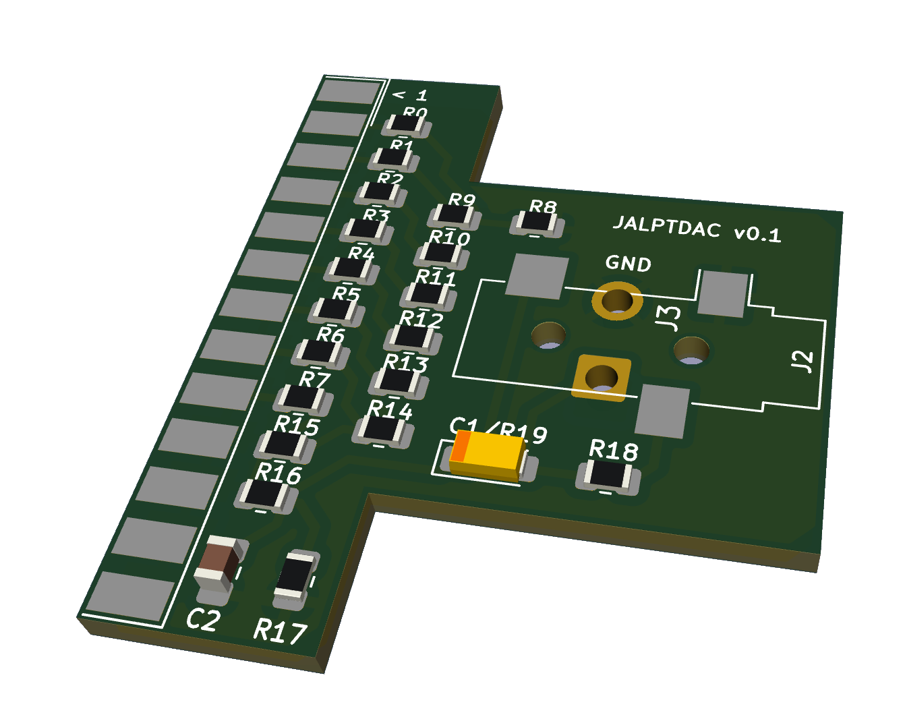
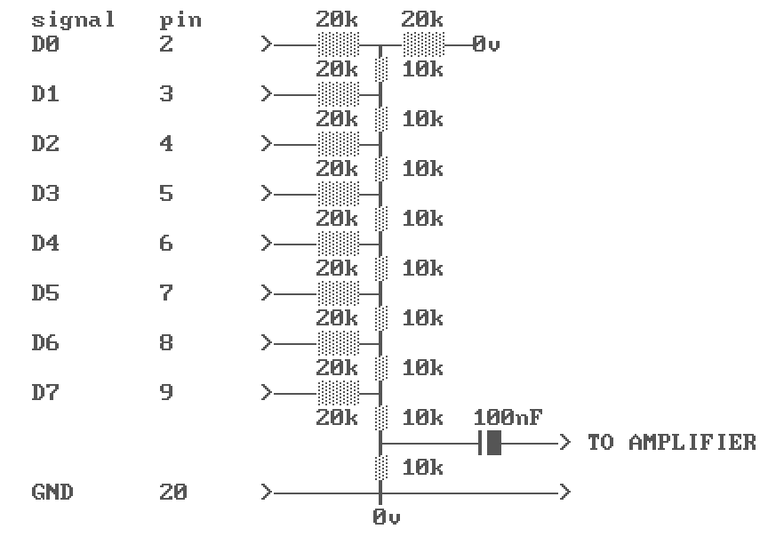
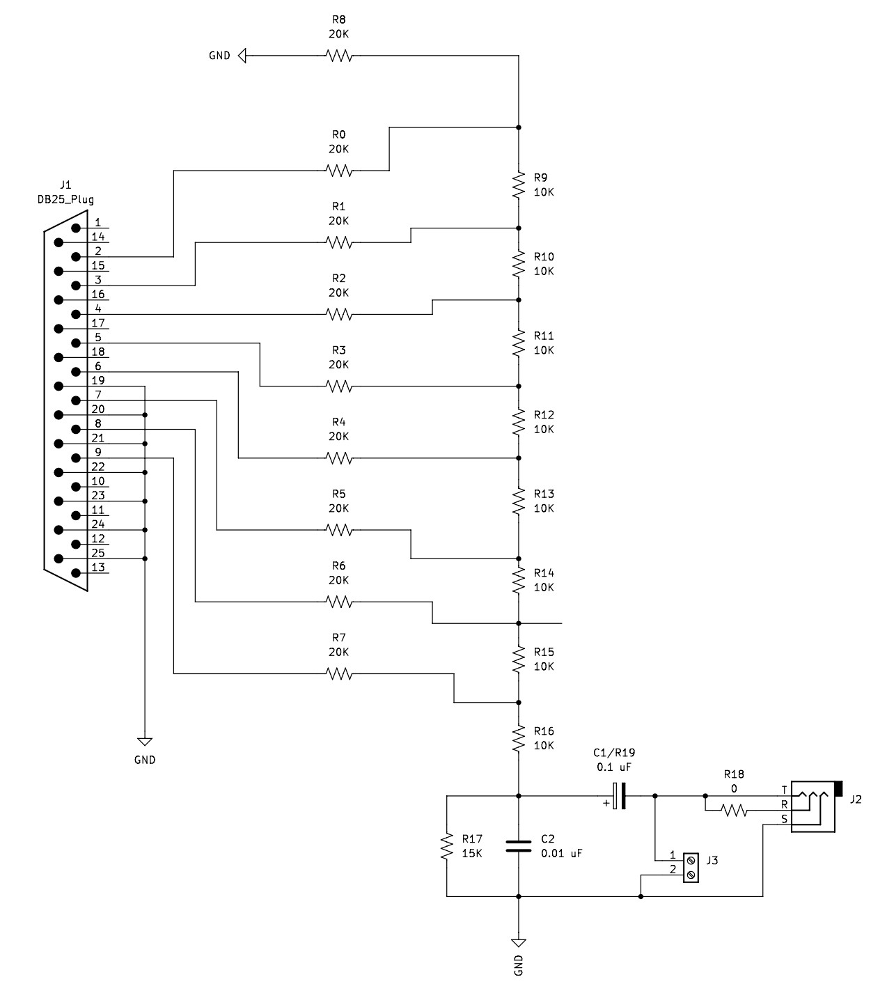

# jalptdac

Just Another LPT DAC

## Table Of Contents
- [Introduction](#introduction)
- [Design](#design)
- [Schematics (Kicad and Gerber files)](#schematics-kicad-and-gerber-files)
- [Build](#build)
  - [Option #1 (MODPLAY PRO Recommendation)](#option-1-modplay-pro-recommendation)
  - [Option #2 (COVOX)](#option-2-covox)
- [Pictures and videos](#pictures-and-videos)
- [References](#references)

## Introduction

JALPTDAC is a minimalist LPT R-2R DAC that could be assembled within a DSUB-25 connector case. The initial design was inspired by the 1994 [COMPUSOUND interface](https://raw.githubusercontent.com/wiki/charlysan/jalptdac/images/magazine.jpg). The latter appears to be an implementation of the MODPLAY PRO Hardware recommendation:

  

## Design

The design is somehow flexible, allowing you to choose from several alternatives:

1. Solder a cable to the output and enclose the PCB within a case (like COMPUSOUND)
2. Add a 3.5 female plug connector (and use it without the case)
3. Implement MODPLAY PRO approach (R = 10K)
4. Implement original Covox design (R = 100K)

## Schematics (Kicad and Gerber files)

  

You can find Kicad files under [./kicad](./kicad/) folder, and Gerber files can be found [here](./kicad/v0.1/gerber/).

## Build

You will need to use high precision resistors (>= 1% tolerance). 

### Option #1 (MODPLAY PRO Recommendation)

| component | Value             | Mouser ID                                    | Notes                      |
|-----------|-------------------|----------------------------------------------|----------------------------|
| R0-R8     | 20K - 0.1%        | [ERA-6AEB203V](https://mou.sr/48EkaXj)       |                            |
| R9-R16    | 10K - 0.1%        | [ERA-6AEB103V](https://mou.sr/3tSAFQK)       |                            |
| R17       | N/A               |                                              |                            |
| R18       | 0 Ohms            | [RC0805JR-100RL](https://mou.sr/427Xlci)     | (Optional - for dual mono) |
| R19       | N/A               |                                              |                            |
| C1        | 0.1 µF (Polarized)| [T489A104M035ATE20K](https://mou.sr/48ZVXur) |                            |
| C2        | 0.01 µF           | [C0805C103J5RAC7025](https://mou.sr/48YnrR3) |                            |
| J2        | 3.5 Audio Jack    | [SJ-3524-SMT-TR](https://mou.sr/3SrcnWj)     |         (Optional)         |

### Option #2 (COVOX)

| component | Value             | Mouser ID                                    | Notes                      |
|-----------|-------------------|----------------------------------------------|----------------------------|
| R0-R7     | 200K - 0.1%       | [ERA-6AEB203V](https://mou.sr/48EkaXj)       |                            |
| R8        | N/A               |                                              |                            |
| R9-R15    | 100K - 0.1%       | [ERA-6AEB103V](https://mou.sr/3tSAFQK)       |                            |
| R16       | 0 Ohms            | [RC0805JR-100RL](https://mou.sr/427Xlci)     |                            |
| R17       | 24K               | [6AEB243V](https://mou.sr/424skpI)           |                            |
| R18       | 0 Ohms            | [RC0805JR-100RL](https://mou.sr/427Xlci)     | (Optional - for dual mono) |
| R19       | 0 Ohms            | [RC0805JR-100RL](https://mou.sr/427Xlci)     |                            |
| C1        | N/A               |                                              |                            |
| C2        | 5100 pF           | [C0805C512F4HACAUTO](https://mou.sr/48FHVhY) |                            |
| J2        | 3.5 Audio Jack    | [SJ-3524-SMT-TR](https://mou.sr/3SrcnWj)     |         (Optional)         |

**Note**: If you decide to use a 3.5 female plug, you can choose between mono and dual-mono output; for dual-mono just short R18 (or add a 0 Ohms resistor)

## Pictures and videos

[Wiki section](https://github.com/charlysan/jalptdac/wiki) includes some pictures and examples.

## References

- [The Covox Years](https://scalibq.wordpress.com/2017/11/28/the-covox-years/)
- [DOScember Making Covox/DAC Hardware and Software](https://www.youtube.com/watch?v=DfNsAK710kQ)
- [Silly Sound Bastard](https://www.youtube.com/watch?v=DKLKtH_rQJU)

**Special thanks to**: [Scali](https://scalibq.wordpress.com/author/scalibq/page/2/), [CallousCoder](https://www.youtube.com/@CallousCoder), & [Necroware](https://www.youtube.com/@necro_ware)
